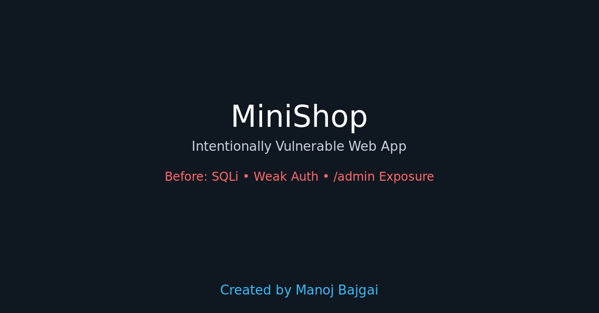

# MiniShop — Intentionally Vulnerable Security Lab (Complete Guide)

**WARNING:** This project is intentionally vulnerable and built for learning. Run only in an isolated VM / host-only network. Do **NOT** expose this application to the public internet.




---

## Quick summary
MiniShop is a minimal Node.js + Express + SQLite web app intentionally designed to demonstrate common web vulnerabilities:
- **SQL Injection (SQLi)** — `/product?id=...` is vulnerable (string concatenation).
- **Weak authentication** — plaintext passwords in seed.
- **Broken access control** — `/admin` dumps users without auth.
- Minimal session/config issues (weak session secret, no secure cookie flags).

This repository contains:
- `app/` — application code (vulnerable on purpose)
- `docker/` + `docker-compose.yml` — container config
- `make_test.sh` — automated artifact collector (optional)
- `fix_vulns.patch` — patch that fixes the main issues (parameterized queries, bcrypt, admin middleware)
- `WRITEUP.md` — short write-up & PoC (optional)
- `README.md` — this comprehensive guide

---

## Goals
People who clone this repo should be able to:
1. Run the vulnerable app in an isolated environment.
2. Reproduce the vulnerabilities and collect evidence.
3. Understand the fixes and test the patched variant.
4. Use the repo as a safe learning lab or a portfolio item.

---

## Requirements (host/VM)
- Docker & docker-compose
- git
- sqlite3 (optional, for host inspection)
- nmap (optional)
- sqlmap (optional, for automated SQLi)

Debian-based install example:
```bash
sudo apt update
sudo apt install -y docker.io docker-compose git sqlite3 nmap
# sqlmap optional:
sudo apt install -y sqlmap
sudo systemctl enable --now docker

---

## 🔧 Fixing the Vulnerabilities & Testing the Patched Variant

A patch file `fix_vulns.patch` is included in this repository.  
It fixes the major vulnerabilities by:

- Replacing string-concatenated SQL with **parameterized queries**  
- Adding **bcrypt** password hashing  
- Securing `/login` with safe comparisons  
- Adding an **admin-check middleware** to protect `/admin`  
- Improving session handling

### 1) Create a safe branch
```bash
git checkout -b fix/sql-injection-bcrypt
MD

**Fixed variant:** A secure version is available in branch `fix/sql-injection-bcrypt`.  
See the "Fix & Patched Variant Guide" section for instructions on applying and testing the patch.
